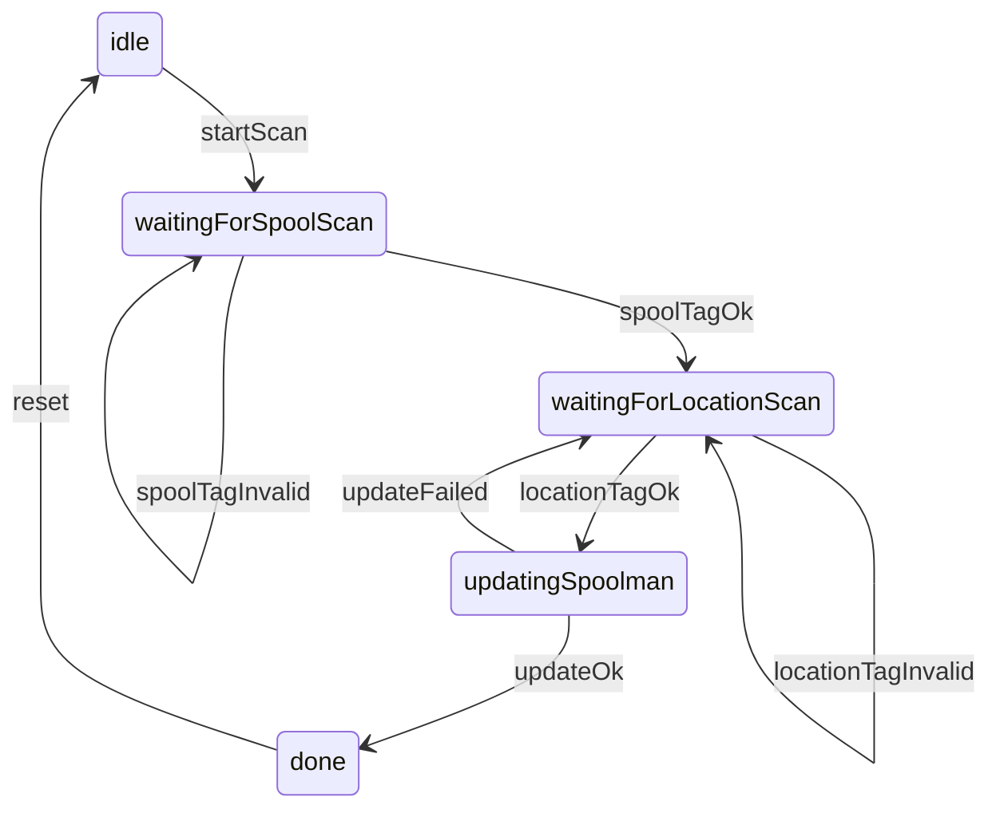

# NFC workflows (spool ↔ location ↔ Spoolman)

This document describes the intended NFC flows for Filament-Chamber.

Related docs:

- OPT summary: `server/docs/nfc/openprinttag.md`
- Filament-Chamber custom records: `server/docs/nfc/filament-chamber-records.md`
- Spoolman API spec (vendored): `server/spoolman/openapi-3.0.yaml`

## Core goal

User scans:

1. a **spool tag** (OPT + `spool_id` link), then\n
2. a **location tag** (`location` link),\n
   and the app updates the spool’s `location` field in Spoolman.

## Read flow (happy path)

1. **Scan spool tag**
   - Read all NDEF records.
   - Parse:
     - OPT record (`application/vnd.openprinttag`) for material metadata (optional but preferred for UI).
     - Spoolman-link record (`application/vnd.filament-chamber.spoolman+json`) to get `spool_id`.
2. **Scan location tag**
   - Read all NDEF records.
   - Parse location-link record (`application/vnd.filament-chamber.location+json`) to get `location` (string).
3. **Update Spoolman**
   - Call Spoolman API:
     - `PATCH /spool/{spool_id}`
     - JSON body: `{ "location": "<location>" }`

## Error handling / validation rules

- Missing `spool_id` record on spool tag:
  - Do not proceed to location scan; show “This is not a Filament-Chamber spool tag”.
- Missing OPT record:
  - Still proceed if `spool_id` exists; UI just has less context.
- Missing location record on location tag:
  - Do not call Spoolman; show “This is not a location tag”.
- Multiple matching records:
  - Prefer the first matching record, but log/show a warning (future: choose newest if we add timestamps).
- JSON parse errors:
  - Treat as invalid tag.
- Unsupported `version`:
  - Treat as invalid tag (or “unknown version”).

## Suggested “write tag” flows (nice-to-have)

### Write spool tag

Inputs:

- OPT payload (from UI / vendor / manual entry)
- Spoolman `spool_id`

Write:

- NDEF message with:
  - OPT MIME record `application/vnd.openprinttag` (binary payload)
  - spoolman-link MIME record `application/vnd.filament-chamber.spoolman+json` (JSON payload)

### Write location tag

Inputs:

- Spoolman `location` string (e.g. `CabinetA/R2C3`)

Write:

- NDEF message with:
  - location-link MIME record `application/vnd.filament-chamber.location+json`

## State machine (UI-independent)

